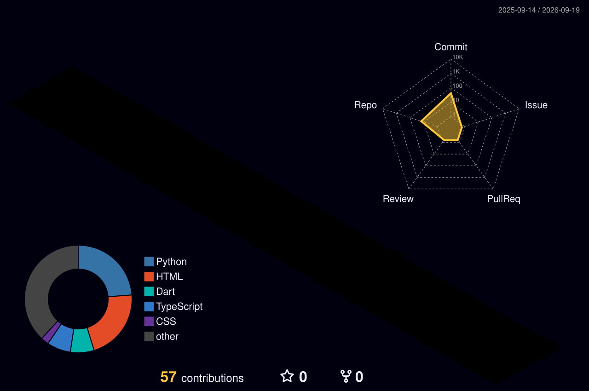

<!-- ============================================================
     AKANKSHYA PATRA — GitHub Profile
     ============================================================ -->

<div align="center">


<br>


<br><br>


</div>

<br>

---

<div align="center">

# `AI / ML / SOFTWARE`

### Building intelligent systems. Crafting digital experiences.

</div>

<br>

## `01 / ABOUT ME`

I'm an **AI Engineer and Full Stack Developer** passionate about building intelligent, scalable applications.

I work across **Machine Learning, NLP, Generative AI, Computer Vision, and modern web development**. I enjoy transforming ideas into real-world products through **Python, React, Java, SQL, APIs, automation, and continuous experimentation**.

Currently exploring:

`LLM FRAMEWORKS` · `NLP` · `COMPUTER VISION` · `TIME-SERIES` · `AI AGENTS`

<br>

---

## `02 / SYSTEM PROFILE`

<div align="center">

<table>
<tr>

<td align="center" width="220">

### `AI`

**Artificial Intelligence**

Machine Learning  
NLP  
Predictive Analytics  
AI Applications

</td>

<td align="center" width="220">

### `WEB`

**Full Stack Development**

React  
TypeScript  
REST APIs  
Modern UI

</td>

<td align="center" width="220">

### `CODE`

**Software Engineering**

Python  
Java  
SQL  
Git

</td>

<td align="center" width="220">

### `BUILD`

**Product Development**

Automation  
AI Agents  
Experiments  
Digital Products

</td>

</tr>
</table>

</div>

<br>

---

## `03 / TECH STACK`

### `ARTIFICIAL INTELLIGENCE`

<div align="center">


<br><br>

`MACHINE LEARNING` · `NLP` · `COMPUTER VISION` · `TIME-SERIES` · `PREDICTIVE ANALYTICS`

</div>

<br>

### `FULL STACK`

<div align="center">


</div>

<br>

### `BACKEND / DATABASE`

<div align="center">


</div>

<br>

### `ENGINEERING TOOLKIT`

<div align="center">


</div>

<br>

---

# `04 / GITHUB ANALYTICS`

<div align="center">


</div>

<br>

<div align="center">


</div>

<br>

---

# `05 / CONTRIBUTION STREAK`

<div align="center">


</div>

<br>

---

# `06 / CONTRIBUTION ACTIVITY`

<div align="center">


</div>

<br>

---

# `07 / COMMIT GRAPH`

<div align="center">


</div>

<br>

---

# `08 / 3D CONTRIBUTION SPACE`

<div align="center">



<br>

`CONTRIBUTIONS → CONSISTENCY → GROWTH`

</div>

<br>

---

# `09 / GITHUB TROPHIES`

<div align="center">


</div>

<br>

---

# `10 / FEATURED PROJECTS`

<div align="center">

### `MEDORA AI`

<a href="https://github.com/Akankshya908/Medora-AI">


</a>

**AI · NLP · Machine Learning · Predictive Analysis**

<br><br>

### `AURA FINTECH`

<a href="https://github.com/Akankshya908/aura-fintech-platform">


</a>

**FinTech · React · TypeScript · Modern UI**

<br><br>

### `PORTFOLIO`

<a href="https://github.com/Akankshya908/Portfolio">


</a>

**Creative Development · React · TypeScript · Interactive UI**

</div>

<br>

---

# `11 / CURRENTLY BUILDING`

<div align="center">

```text
                    ┌─────────────────┐
                    │   IDEA / INPUT  │
                    └────────┬────────┘
                             │
                             ▼
                    ┌─────────────────┐
                    │   AI / ML       │
                    └────────┬────────┘
                             │
                             ▼
                    ┌─────────────────┐
                    │   API / LOGIC   │
                    └────────┬────────┘
                             │
                             ▼
                    ┌─────────────────┐
                    │   WEB / UI      │
                    └────────┬────────┘
                             │
                             ▼
                    ┌─────────────────┐
                    │     PRODUCT     │
                    └─────────────────┘
````
</div> <br>

13 / CONNECT
<div align="center"> <a href="mailto:akankshyapatra908@gmail.com">  </a> <a href="https://linkedin.com/in/akankshya-patra-2193b4288">  </a> <a href="https://www.kaggle.com/akankshya908">  </a> <a href="https://github.com/Akankshya908">  </a> </div> <br> <div align="center">


</div> <br> <div align="center">


</div> 
